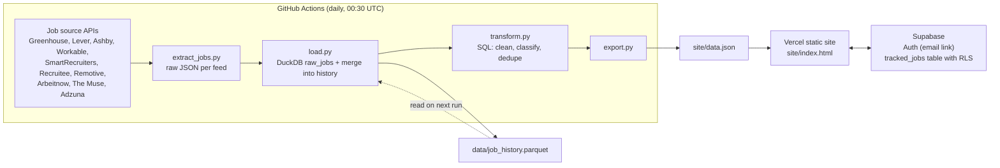

# SignalStack

A daily-updated job board and application tracker, built on a small batch data pipeline that collects openings from company career pages and public job boards.

**Live site:** https://signalstack-theta.vercel.app

<!-- stats:start -->
As of the 2026-09-24 run: 5,462 open jobs from 310 companies, collected from 10 configured sources (9 returned jobs in that run), with 2 days of history (2026-09-23 to 2026-09-24).
<!-- stats:end -->

## What it does

- Lists current openings from company career pages and job boards in one place, with a direct Apply link to each posting.
- Splits jobs into **Freshers** (internships, new grad and entry level, 0-2 years) and **Experienced** segments.
- Filters by posted date, workplace (remote, hybrid, on-site), country, state, city, role type, level, company and source.
- Signed-in users (email sign-in link, no password) can save jobs, set a status (saved, applied, interviewing, offer, rejected) and add notes. Guests can browse and filter everything.

## Architecture



| Step | File | What happens |
| --- | --- | --- |
| Extract | `extract_jobs.py` | Calls one API per company in `companies.csv` plus four multi-company boards. Saves each response to `data/raw/jobs/<date>/<source>__<feed>.json`. A failing source is logged and skipped. |
| Load | `load.py` | Parses every source into one standard schema, loads it into DuckDB as `raw_jobs`, and merges the day into `data/job_history.parquet`. |
| Transform | `transform.py` | SQL in DuckDB: normalises locations, classifies role type and level, marks the Fresher/Experienced group, picks the current jobs and removes cross-source duplicates. |
| Export | `export.py` | Writes the listed jobs and per-source counts to `site/data.json`. |
| Serve | `site/` | A single static HTML page (no build step) that loads `data.json` and talks to Supabase from the browser. |

The workflow commits only `data/job_history.parquet` and `site/data.json`.

## Key design decisions

**Daily batch, not real time.** Job postings change on the scale of days, and several sources ask for limited use (Remotive asks for at most 4 calls a day; Adzuna's free plan is rate limited). One scheduled run a day keeps API usage low, needs no servers, and lets the site be plain static files.

**New and closed jobs from the history file.** `job_history.parquet` holds one row per job ever seen, keyed by `(source, feed, job_id)`, with `first_seen` and `last_seen` dates. Each run updates `last_seen` for jobs still listed and adds new ones.
- A job is **current** if its `last_seen` equals the latest date its board was fetched. Anything older has closed and drops out of the listing. If a board fails, its last known jobs are kept for up to 3 days.
- A job is **new** if it was first seen on the latest run of a board that was already being tracked before that day, so adding a new company does not mark all of its jobs as new.
- Re-running on the same day is safe: `prev_seen` lets `load.py` undo that day's merge for a board and redo it.
- A job the user is tracking that has closed still shows in their tracker, marked "No longer listed", from a copy saved with the tracked row.

**Duplicates across sources.** The same opening often appears on a company board and on an aggregator. `transform.py` treats two jobs from different sources as the same when the company name (with suffixes like Inc, Ltd, GmbH removed), place and level match and the normalised titles are equal or have a Jaro-Winkler similarity of at least 0.95. The copy from the direct company board is kept, so Apply links go to the employer.

**Raw JSON is no longer committed.** Committing every raw API response added about 30 MB to the repository each day. The pipeline only needs the latest snapshot plus first/last-seen dates, so raw files are now merged into the history file and then discarded (kept locally for 3 days for debugging, and ignored by git). The parquet file is sorted and written uncompressed so git can store each day's version as a small delta.

**Row Level Security for user data.** The site uses Supabase's publishable key, which is public by design. Access is controlled in the database (`supabase/schema.sql`):
- `tracked_jobs` has RLS enabled, with select, insert, update and delete policies that all require `auth.uid() = user_id`.
- `user_id` defaults to `auth.uid()`, so the client cannot write rows for someone else.
- The `anon` role has no grants, so signed-out visitors cannot read the table at all.
- Rows are deleted with the user's account (`on delete cascade`), and check constraints limit note and payload sizes.

## Tech stack

- Python 3.11 (requests, pandas)
- DuckDB (storage and SQL transforms) and Parquet (job history)
- GitHub Actions (daily schedule)
- Vercel (static hosting)
- Supabase (email sign-in, Postgres with Row Level Security)
- Vanilla HTML, CSS and JavaScript with supabase-js

## Running it locally

Requires Python 3.11+.

```bash
git clone https://github.com/JyotishkaGhosh/signalstack.git
cd signalstack
python -m venv .venv
source .venv/bin/activate        # Windows: .venv\Scripts\activate
pip install -r requirements.txt
cp .env.example .env             # then fill in the values below
```

`.env` needs:

```
ADZUNA_APP_ID=
ADZUNA_APP_KEY=
```

Free keys are available at https://developer.adzuna.com. Without them the Adzuna source fails and is skipped; every other source needs no key. In GitHub Actions the same names are set as repository secrets.

Run the pipeline and serve the site:

```bash
python extract_jobs.py   # fetch today's raw JSON into data/raw/jobs/<date>/
python load.py           # load into signalstack.duckdb, update data/job_history.parquet
python transform.py      # clean, classify and dedupe in SQL
python export.py         # write site/data.json

python -m http.server 8000 --directory site
```

Then open http://localhost:8000.

To use your own Supabase project for sign-in and tracking: run `supabase/schema.sql` in the Supabase SQL editor, then put your project URL and publishable key in `site/config.js`. Never put the secret key in the site.

To track more companies, add rows to `companies.csv` (`company` is the board's slug, `ats` is one of `greenhouse`, `lever`, `ashby`, `workable`, `smartrecruiters`, `recruitee`).

## Data sources and credits

Job data comes from the public APIs of these services. Every job links back to its original posting.

- Company career boards: [Greenhouse](https://www.greenhouse.com), [Lever](https://www.lever.co), [Ashby](https://www.ashbyhq.com), [Workable](https://www.workable.com), [SmartRecruiters](https://www.smartrecruiters.com), [Recruitee](https://recruitee.com)
- Job boards: [Remotive](https://remotive.com), [Arbeitnow](https://www.arbeitnow.com), [The Muse](https://www.themuse.com), [Jobs by Adzuna](https://www.adzuna.in)

All job listings remain the property of the employers and sources that publish them.

---

Built by Jyotishka Ghosh and special thanks to Ritankar Mondal.
